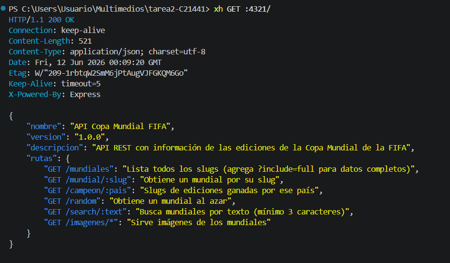
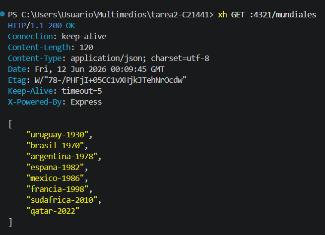
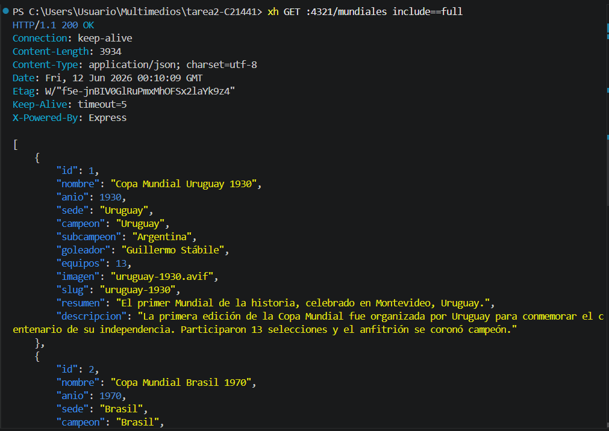
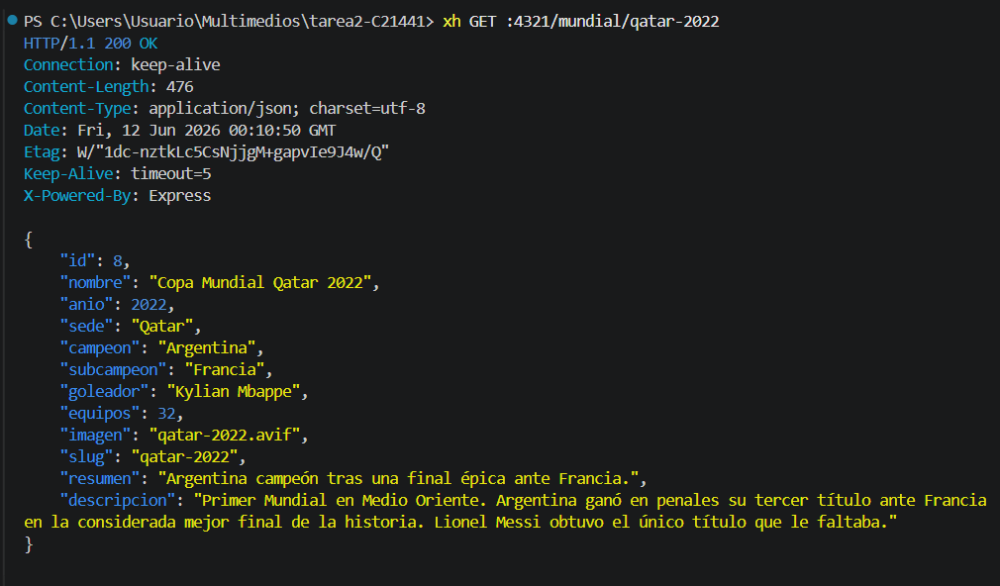
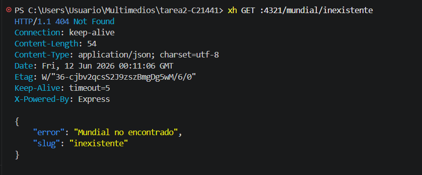
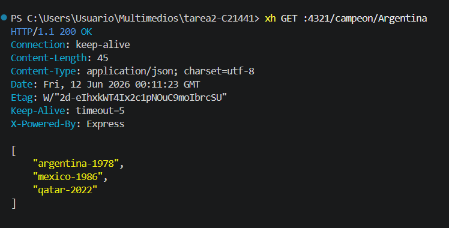
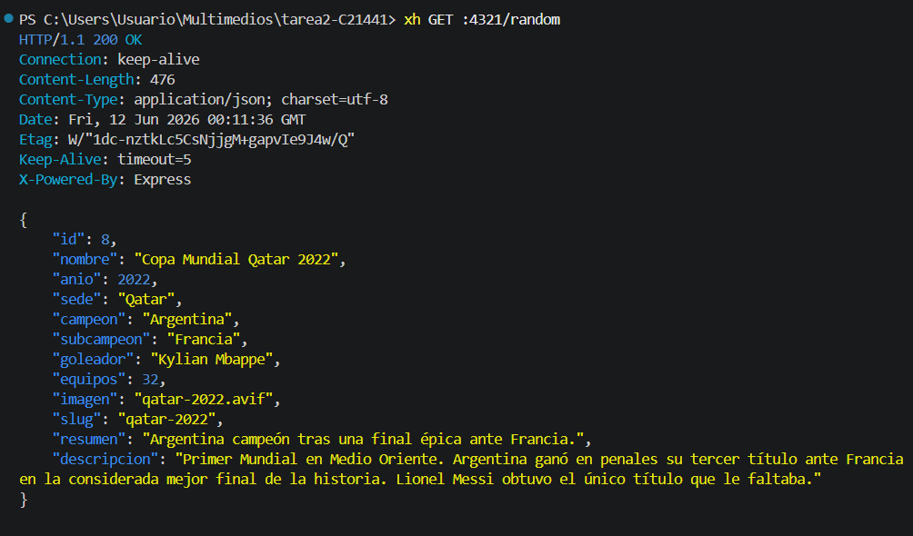
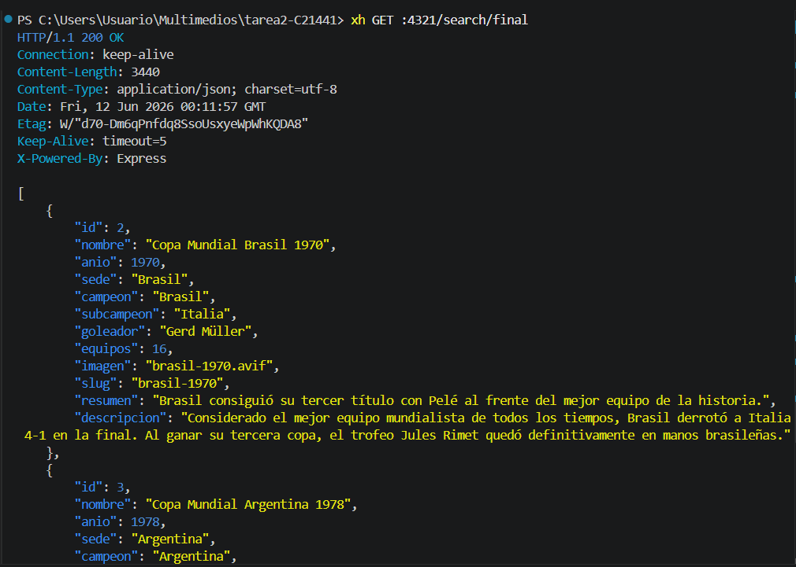
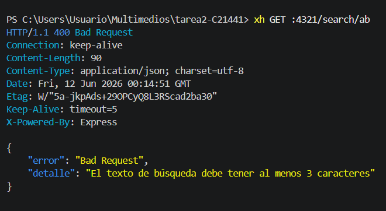

# API Copa Mundial FIFA 
 
API REST construida con Node.js + Express + SQLite que expone información sobre las ediciones de la Copa Mundial de la FIFA.
 
## Tecnologías
 
- Node.js
- Express
- SQLite (`node:sqlite`)
- Zod (validación)
- pnpm
## Requisitos
 
- Node.js v22+
- pnpm
## Instalación
 
```bash
cd src
pnpm install
```
 
## Poblar la base de datos
 
```bash
cd src
node seed.js
```
 
## Ejecutar el servidor
 
```bash
cd src
node --watch index.js
```
 
El servidor corre en `http://localhost:4321`
 
## Rutas disponibles
 
| Ruta | Descripción |
|------|-------------|
| `GET /` | Información del API |
| `GET /mundiales` | Lista todos los slugs |
| `GET /mundiales?include=full` | Lista todos los mundiales con datos completos |
| `GET /mundial/:slug` | Obtiene un mundial por su slug |
| `GET /campeon/:pais` | Slugs de ediciones ganadas por ese país |
| `GET /random` | Mundial aleatorio |
| `GET /search/:text` | Busca mundiales por texto (mínimo 3 caracteres) |
| `GET /imagenes/*` | Sirve las imágenes de los mundiales |
 
## Imágenes de los mundiales
 
Las imágenes se encuentran en `src/imagenes/` y se sirven bajo `/imagenes/`:
 
| Imagen | Mundial |
|--------|---------|
| `uruguay-1930.avif` | Uruguay 1930 |
| `brasil-1970.avif` | Brasil 1970 |
| `argentina-1978.avif` | Argentina 1978 |
| `espana-1982.avif` | España 1982 |
| `mexico-1986.avif` | México 1986 |
| `francia-1998.avif` | Francia 1998 |
| `sudafrica-2010.avif` | Sudáfrica 2010 |
| `qatar-2022.avif` | Qatar 2022 |
 
> Ejemplo: `http://localhost:4321/imagenes/qatar-2022.avif`
 
## Pruebas con xh
 
### `GET /`

 
### `GET /mundiales`

 
### `GET /mundiales?include=full`

 
### `GET /mundial/qatar-2022`

 
### `GET /mundial/inexistente` → 404

 
### `GET /campeon/Argentina`

 
### `GET /random`

 
### `GET /search/final`

 
### `GET /search/ab` → 400


### `http://localhost:4321/imagenes/qatar-2022.avif`

